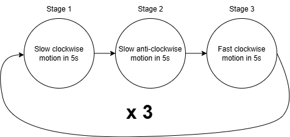

# PLC-Based Servo Motor Motion Control using TwinCAT 3

## Overview
This project involved the design and implementation of a PLC-based motion control sequence using Beckhoff TwinCAT 3 and the TC2_MC2 motion control library.
A Beckhoff AM8012 servo motor driven by an AX5206 servo drive was programmed using structured Text to execute a predefined sequence of clockwise and anticlockwisse movements at varying speeds.
The system performance was evalueated using position and velocity measurements generated suring execution.

## Project Information
Author: Edidiong Enobong Umoh

Institution: University of Debrecen

Project Type: Academic Motion Control Project

Platform: Beckhoff TwinCAT 3

Programming language: Structured Text (IEC 61131-3)
